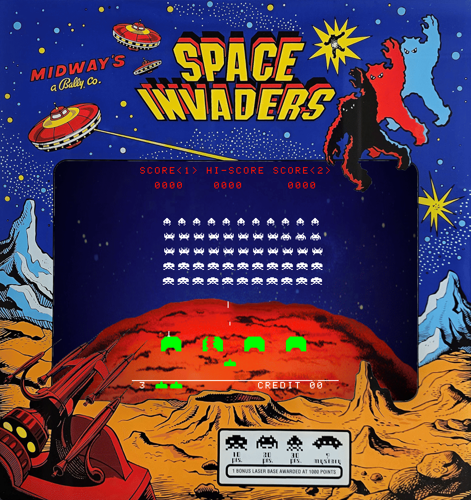
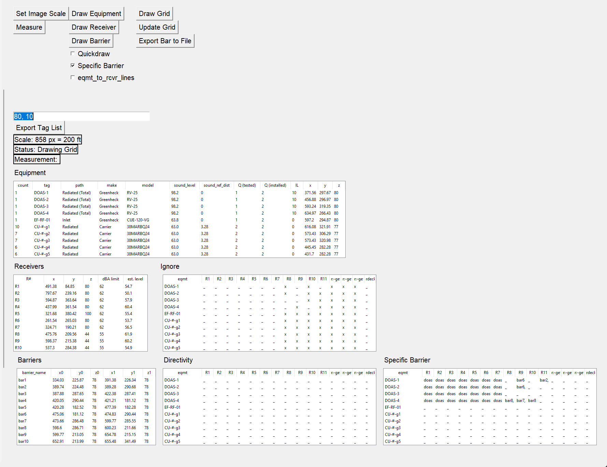
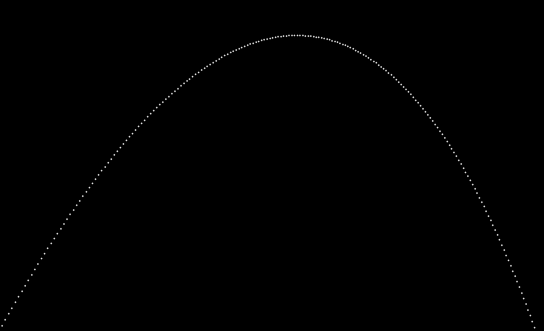

Hi, I'm Craig Harris and I'm a recent graduate of Oregon State University with a Bachelor's degree in Computer Science.

Here you can find screenshots from some of my projects.

 

# [Capstone Project](https://github.com/cxhx441/space_invaders_8080)

# [Property Line Noise Prediction](https://github.com/cxhx441/graphical-acoustic-calcs)
<!--    -->
  
  

# [Tetris](https://github.com/cxhx441/tetris)
  

# [Ray Tracer Challenge (IN PROGRESS)](https://github.com/cxhx441/ray-tracer-challenge)
  
  
  

 

<!--
**cxhx441/cxhx441** is a ✨ _special_ ✨ repository because its `README.md` (this file) appears on your GitHub profile.

Here are some ideas to get you started:

- 🔭 I’m currently working on ...
- 🌱 I’m currently learning ...
- 👯 I’m looking to collaborate on ...
- 🤔 I’m looking for help with ...
- 💬 Ask me about ...
- 📫 How to reach me: ...
- 😄 Pronouns: ...
- ⚡ Fun fact: ...
-->
