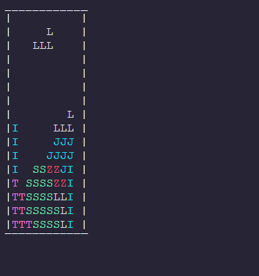
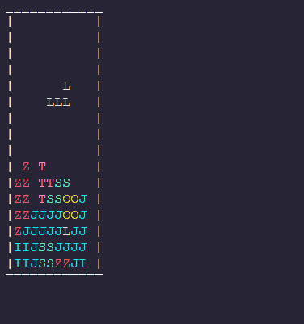
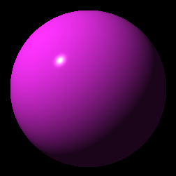
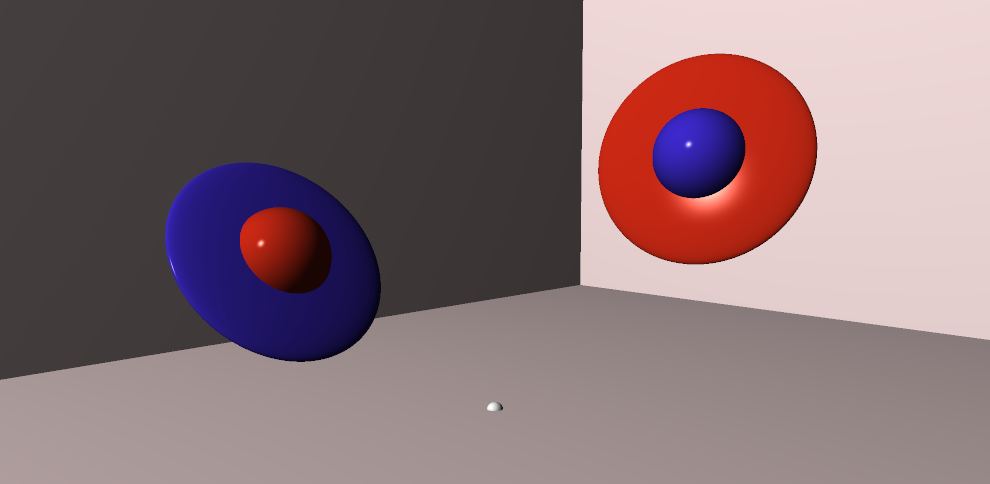
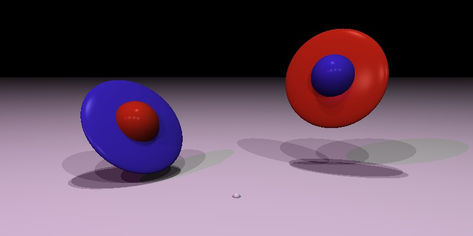
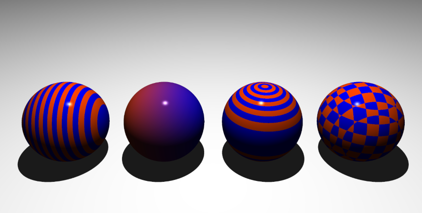

Hi, I'm Craig Harris and I'm a recent graduate of Oregon State University with a Bachelor's degree in Computer Science.

Here you can find screenshots from some of my projects.

 

<!-- 
 -->

## [Capstone Project: Intel 8080 Emulator](https://github.com/cxhx441/space_invaders_8080)

## [Zelda A Link to the Past Opening](https://github.com/cxhx441/cs450/tree/main/final_turn_in)

## [Chladni Plate Shader Sim](https://github.com/cxhx441/cs457/blob/main/visual_studio/OpenGL_FinalProject/OpenGL/src/Application.cpp)
  

## [Property Line Noise Prediction](https://github.com/cxhx441/graphical-acoustic-calcs)
<!--    -->
 
<!--    -->

## [Command-Line Tetris](https://github.com/cxhx441/tetris)
   

## [Ray Tracer Challenge (IN PROGRESS)](https://github.com/cxhx441/ray-tracer-challenge)
 
 

 

 

<!--
**cxhx441/cxhx441** is a ✨ _special_ ✨ repository because its `README.md` (this file) appears on your GitHub profile.

Here are some ideas to get you started:

- 🔭 I’m currently working on ...
- 🌱 I’m currently learning ...
- 👯 I’m looking to collaborate on ...
- 🤔 I’m looking for help with ...
- 💬 Ask me about ...
- 📫 How to reach me: ...
- 😄 Pronouns: ...
- ⚡ Fun fact: ...
-->
